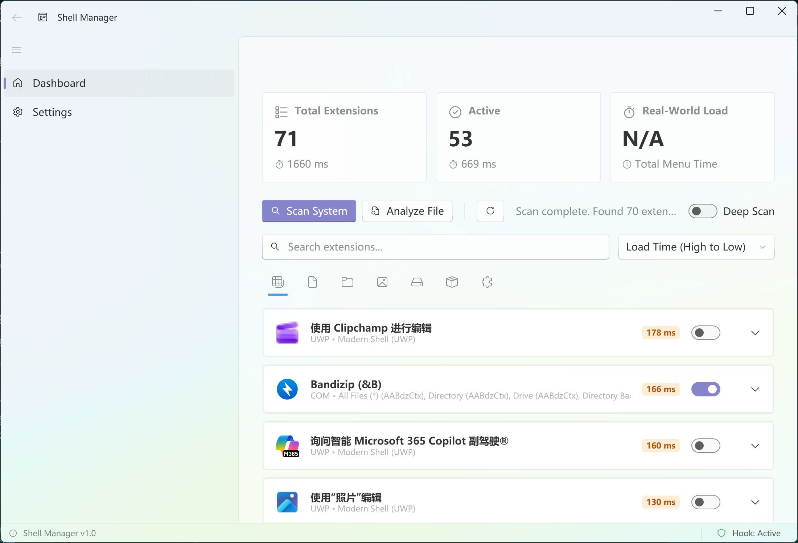

# ContextMenuProfiler

一个现代的 Windows 右键菜单分析与管理工具。能够精准测量每个菜单扩展的加载时间，并支持开启/禁用每个右键菜单扩展。

## 🚀 核心功能

- **精准测速**：直接在 Explorer 进程内测量 `create` (创建)、`init` (初始化) 和 `query` (查询) 的毫秒级耗时。
- **扩展管理**：一键启用或禁用扩展，轻松优化系统右键菜单响应速度。
- **全面支持**：不仅支持传统的 COM 扩展，还完美支持现代 UWP/Sparse Package (如 PowerToys, VS Code) 以及静态注册表项。
- **架构稳健**：采用进程外 IPC 通信和 SEH 异常保护机制，确保在分析过程中 Explorer 的稳定性。

## ⚠️ 安全提示与误报说明

由于本工具的工作原理涉及将 Hook DLL (`ContextMenuProfiler.Hook.dll`) 注入到 `explorer.exe` 进程中以监测性能，这种行为（Process Injection / API Hooking）与某些恶意软件的行为特征相似。

因此，**Windows Defender、火绒、360 等安全软件可能会将其误报为 `Trojan/Injector`**。

- 本项目完全开源，所有代码均在 [GitHub](https://github.com/) 上可见，您可以随时审查。
- 我们建议在运行前将项目目录添加到杀毒软件的**信任区/排除列表**。
- 如果您不信任本工具，请勿运行。

## 🛠️ 快速开始

### 环境要求
- Windows 10/11 (x64)
- Visual Studio 2022 或 2026 (需安装 C++ 桌面开发组件)
- .NET 8 SDK

### 构建与运行
1. 以管理员身份运行 `scripts\redeploy.bat`。
   - 脚本会自动查找您的 Visual Studio 安装路径，构建 Hook DLL 并将其注入到 Explorer 中。
2. 打开 `ContextMenuProfiler.UI` 开始扫描。

## 📄 开源协议

本项目采用 [MIT License](LICENSE) 授权。

### 第三方协议
- **MinHook**: [BSD 2-Clause License](LICENSE-MINHOOK) (Copyright (C) 2009-2017 Tsuda Kageyu).
